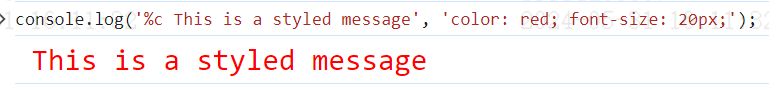

### 常用的占位符：
<ol>
  <li> %s - 字符串</li>
  <li>%d 或者 %i - 整数</li>
  <li> %f - 浮点数</li>
  <li> %o - 对象</li>
  <li>%c - CSS 样式</li>
</ol>

```
  const name = 'Alice';
  const age = 30;
  console.log('Name: %s, Age: %d', name, age); // Name: Alice, Age: 30
```

```
console.log('%c This is a styled message', 'color: red; font-size: 20px;');
```
可以使用 %c 占位符添加 CSS 样式，使输出内容更加美观。
